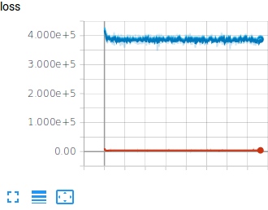

# VAE

This repository is reproducing of [Auto-Encoding Variational Bayes](https://arxiv.org/abs/1312.6114).

Experiments is done for celeba dataset.

# Requirements
- Pytorch 0.4.0
- Python 3.6

# ToDo
- [ ] reconstruction checking 
- [ ] Generating Faces 
- [ ] latent variable interpolation

# Results
 - Loss of training

 - Reconstructed results(left: original, right: reconstructed)

 - Generation results

